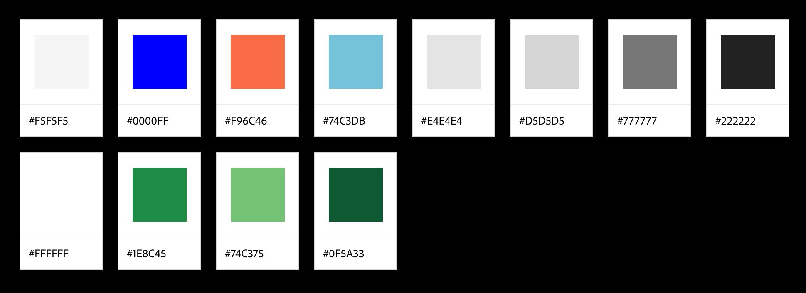

# Guidelines for visual style

The goal of these guidelines is to help to create a visually uniform set of DINA modules with consistently working user interfaces, so that users are not surprised or confused when transitioning between modules.

Guidelines can be used in various settings, such as:

- Web applications on both desktop and mobile devices
- Console applications
- Printed publications (part on visual style)
- Documentation

## Accessibility

Visual style should support good accessibility, and therefore particulary web content should conform as much as reasonable with the [W3C guidelines for web content accessibility](http://www.w3.org/TR/WCAG20/).

## Fonts

Requirements fo the fonts used in DINA applications:

- Support for wide variety of languages and characters.
- Open license is required
- Web fonts and TTF versions should exist (or be possible to create) for use on Windows, Linux, Mac providing same appearance regardless of OS used
- A serif, a sans serif and a fixed width “console font” should be part of the style. Those three types of fonts should harmonize.

Possible fonts:

- **[Source Sans Pro](http://www.google.com/fonts/specimen/Source+Sans+Pro) / [Source Serif Pro](http://www.google.com/fonts/specimen/Source+Serif+Pro) / [Source Code Pro](http://www.google.com/fonts/specimen/Source+Code+Pro)**
- **Google Noto** (with great support across cultures/languages)
- **Lato** (currently used in user management module)

## Logo

Logo assets are available at [https://github.com/DINA-Web/dina_logo]

Colors matching the logo:

**Dark green**

* RGB 19, 86, 51
* HEX #135633

**Medium green**

* RGB 30, 140, 67
* HEX #1e8c43

**Light green**

* RGB 116, 195, 116
* HEX #74c374

## Colors

### UI colors

Color palette suggested by UX designer, matching the logo colors:

TODO: Greens don't match the logo

* Background: 
  * Elements (e.g. header, form): white (#ffffff)
  * Background: light gray (#ecf0f1)
* Text: slightly off-black (#222222)
* Actions
  * Primary/Save/Edit: bright blue
  * Warning/Cancel: yellow (TODO: missing from palette)
  * Danger/Delete: red
  * Edit: greyish blue
* Messages
  * Success: green
  * Warning: yellow (TODO: missing from palette)
  * Error: red
  * Information: greyish blue 

### Map and chart colors

An example of a color palette for showing gradual data, matching the discussion below:

Source: [http://colorbrewer2.org/](http://colorbrewer2.org/) (colorscheme with 7 steps, 2-color multihued yellow-green scale, colorblind safe)

## UI elements

Keep buttons aligned to left side. Order of the buttons from left to right:

- Save
- Additional functions
- Cancel

## Terms

Standard terms to use in the modules:

- Sign in & Sign out
- Register [user creating a new account]
- Pending & Enabled & Disabled [account status]
- Confirm [email address]
- Accepted [user]
- Save
- Edit
- Cancel
- Remove vs. Delete - **TBD**
- Move to trash vs. Move to archive - **TBD if needed**

# Further details and rationale 

## Colors

It is very easy to get colors wrong. It is perhaps more important to avoid the worst pitfalls than aiming at achieving perfection.

Keeping the rules discussed below in mind, colors used in the DINA style will be guaranteed to be clearly perceived by most audiences across most media.

- For general visual design use a slightly off-white background with dark gray text
- Avoid using so called RGB color cube "corners"
- Use dark green (see "Logo" above) as the accent color.

Very good guidance when choosing colors that can be perceived clearly is provided by tools like [ColorBrewer 2](http://colorbrewer2.org).

- For colors used, a harmonized and clearly perceivable selection of colors is required
- No more than 7 steps and never more than 2 hues (if multihued) may be used, if users should be able to distinquish different colors
- Aim for colorblind safe choices

A simple way to check that colors used make sense and can be distinguished is to convert to gray scale and check if different colors still can be discerned. A quick such test can ensure that you are in compliance with this guideline from W3C: [http://www.w3.org/TR/WCAG20/#visual-audio-contrast-without-color](http://www.w3.org/TR/WCAG20/#visual-audio-contrast-without-color)

For a more detailed check, tools like [Vischeck](http://www.vischeck.com/vischeck/) can be used to simulate how various kinds of color-blindness would affect perceptions of colors used in an image.

